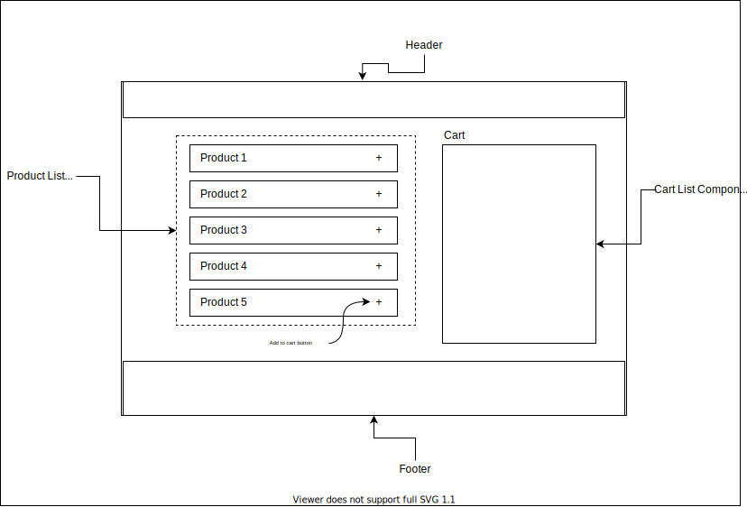
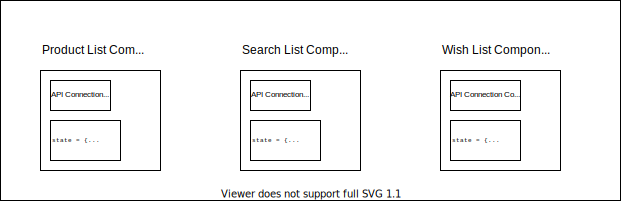
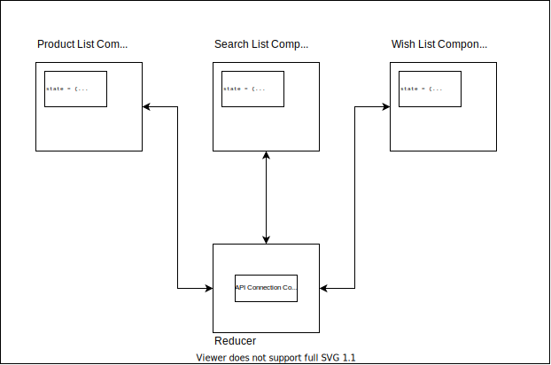

# Why do I need Redux?
Continuing from our discussion on why we need redux, let's see a basic e-commerce react application as our example.

## The Components
As every react application in the world, this e-commerce application also has a few components.

Here are the components:



- **Header:** A placeholder header component.
- **Footer:** A placeholder footer component.
- **Product List:** A component that fetches list of products from the API and displays the product list.
    - **Product Item:** Every single product item is also a standalone component with add button to add the product to the cart.
- **Cart List:** A basic cart list which shows all the products.
    - **Cart Item:** Similar to like in product list, here also we will have a component that represents a single cart item.

---

## State management
As mentioned in this tutorial, Redux is about state management. To better understand why we need state management we need to see how we traditionally handle the state of the application without redux.

In the above architecture there are two array of objects that we need to manage.
- `products`: The list of items in our inventory which we pull from the web app and show in `ProductList` component.
- `cartItems`: The list of items in our cart at any particular time. The items in the cart can be added or removed by interacting with single `ProductItem` inside `ProductList`.

### Without Redux
Now, without Redux, we would write `ProductList` component in such a manner that it loads all the items in the product list as soon as the component loads. Probably in `componentDidMount()` function if using class components or by using `useEffect()` hook if using functional components.

```Javascript
class ProductList extends React.Component {
    componentDidMount() {
        ..
        ...fetch product list and update state
    }
}
```

### The Problem
Now, this is okay to start with. But the problem is your API call is inside your component!! I can't emphasize it enough if the API calls are inside our components it is going to be hard to scale. When multiple people work on a code base, we need a clear separation of concerns.

For example, let's say we want to show product list again perhaps on a search page or wish-list page, we will have to again code the API connection logic inside those components using `componentDidMount()` or `useEffect()`. That's shear wastage of energy and efforts. And what if the backend developer or team decides to change the product list API? We will have to make changes inside **all** the components.



### The Solution
The solution should be obvious to you by now. What we need are **loosely coupled components**. What this means is the code base should be layered with every single layer having its own objective and function. For eg, the API call logic should be centralized in some **file** and components should be able to communicate to that **file**.

#### Step 1


In the diagram you can see how we moved the **API Connection Code** outside of our components in a different file. Notice that the file is labeled as a **reducer** file. We will get to it just in moment why we named it that. And this is still only the **step 1** of the steps required. The API logic is centralized but still we are managing three different state objects inside the component. We still need to use `componentDidMount()` or `useEffect()` functions to call the API logic "somehow" placed in the **reducer** file. 

#### Step 2


Now this is much better. Now even the state of all the components is **centralized** and managed at a single location rather than having it inside the individual components. We should pause here to look at the benefits of this approach.
- **centralized state management:** results in loose coupling between the components and the state. This means, for example, if we want to revamp the search list layout and introduce a `SearchList2.jsx` component file, we don't have to worry about writing the state management or API connection logic again.

- **ability to handle complex scenarios:** What if inside the product list page we have an option to add a product in the wish list. Even inside the search list page we have this option. The objective is as soon as user clicks on **add to wishlist** button, the wish list component should be notified and re-render to showcase the updated number of items inside the wishlist. Without centralized state, this is going to be very complicated thing to achieve. But now as we know, React re-renders the component as soon as state changes, if `wishList[]` array changes, the `WishList` component page will automatically re-render without any extra effort.

- **light weight components:** as all the core logic of state management and API connectivity has moved out of your component, the components can be very light-weight and their core objective could be to render the HTML elements beautifully. This also results in better collaboration in team as multiple developers can now work together in parallel without scary merge conflicts.

## Ok, I am convinced, Redux is way to go! Now tell me how to get started.

[Go to Next Page: Redux Architecture >>]()