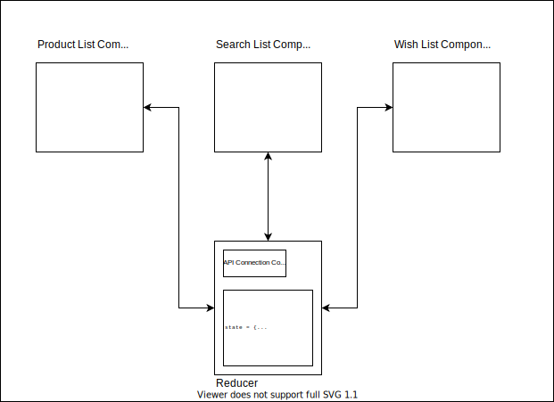

# Redux Architecture
I hope now you are absolutely convinced why we need **centralized state management**. Redux is a nice as well as widely adopted way to achieve it. Before jumping into the code, we need to move forward and learn a few concepts on how Redux makes it possible.

Let's see the previous diagram.



Here we saw how we have moved both application state as well as API connection code outside of our components into a single file named as **reducer**. But in fact, in Redux, **reducers** are just responsible to **change** the state but **does not hold** the state.

## Redux Store

So here we are introducing one more entity. The **store**. Redux store is responsible for storing the current state of the object. Work of reducer is just to manipulate the state object according to the instructions coming from the components.

More accurate chart would be the following:


So for example, if user clicks on **add to wishlist** button on a single product item inside `ProductList.jsx` component, the `ProductList.jsx` component will communicate with the reducer with the information about the exact product which needs to be added. The reducer will then make the necessary changes to the state and may also make an API call for it. As soon as state is changed, relevant components will be notified and re-rendered.

## Redux Actions

There is one last building block that we need to be aware of. Over the last few paragraphs and pages we talked about communication between the **reducer** and the components. The problem is we haven't yet discussed that how this communication happens. If we want to send some instruction to the reducer from our component, what would be the technique to do that? And once the reducer has finished processing, how will it communicate back to the component?

That is exactly where **actions** come in picture. Do not get confused by name, we just call the "messages" or "instructions" that we transfer from our component as "actions" but they are just plain Javascript objects. In fact it should be possible to just pass a string variable as action as well but a standard is used to create the message object. A typical message looks like followig:
```Javascript
{
    type: "ADD_PRODUCT",
    payload: {
        name: "Product name",
        description: "Product description"
    }
}
```

There is no specific rule that the keys should be `type` and `payload` but this has been widely adopted by developers across the globe. `type` key tells what is the instruction and `payload` key shares any extra information that instruction needs to carry to the reducer.

Cool, now we are ready to create our hands-on application. Let's get started!

[Go to Next Page: Hands-On Part 1 >>](https://github.com/theyouthproject/react-redux-hands-on-tutorial/blob/master/docs/03-hands-on-bootstrap-react/01-bootstrap-react.md)