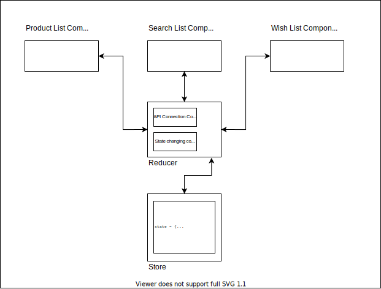
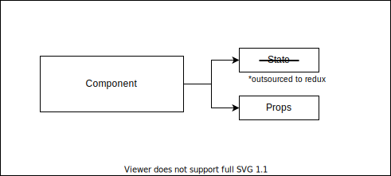

# Hands-On: Part 4 - Component connection

The next and final step is to see how we can connect the reducer with your component.

Just for revision, this is how redux is supposed to work as seen in past pages.



There is a redux store which we just created which stores the state of the application. Next is reducer which handles the `actions` or "instructions" being dispatched from the component. And the third part is the components themselves which initializes the communication.

But first let's complete our current code by adding both `ProductList.jsx` component and `CartList.jsx` component to our `App` component.

#### Step 1: Modify `App.js` to include both the components
```JSX
// src/App.js

import React from 'react';
import './App.css';

import ProductList from './components/ProductList';
import CartList from './components/CartList';

function App() {
  return (
    <div className="App">
      <div className="container-row">
        <ProductList/>
        <CartList/>
      </div>
    </div>
  );
}

export default App;
```

#### Step 2: Add some CSS
Add the following CSS to `src/App.css` file.
```CSS
.App {
    background: whitesmoke;
    height: 100vh;
}

.container-row {
    width: 80%;
    margin: 0 auto;
    padding-top: 50px;
    
    display: flex;
    flex-direction: row;
}

.product-list-container {
    flex: 2;
    margin-right: 20px;
}

.cart-list-container {
    flex: 1;
}

.cart-list {
    padding: 0 20px;
    min-height: 400px;
    background-color: white;
    box-shadow: 1px 1px 4px rgba(0, 0, 0, 0.25);
}

.cart-item {
    padding: 20px;
    border-bottom: 1px solid #ccc;
}

.product-item {
    padding: 10px;
    box-shadow: 1px 1px 4px rgba(0, 0, 0, 0.25);
    background-color: white;

    display: flex;
    flex-direction: row;
    align-items: center;
    margin-bottom: 20px;
}

.product-name {
    flex: 1;
}

.add-to-cart-btn {
    padding: 10px;
}

.add-to-cart-btn:hover {
    cursor: pointer;
    background: #e5e5e5;
}
```

This is how your application should look right now.


## The Theory
Before we do the changes required to connect let's dive into the concept.

Every component in react is gifted with two things by default.



- **state:** Now we can use state object but we have already given that responsibility to redux so using it here would be redundant.
- **props:** Props are the special properties provided to any component by their parent components.

If you have used **React Router** you know that inside props you automatically start getting `props.history` object which is injected by the parent component.

Similarly, `redux` gives you the opportunity to pass the application state to every child component according to the need. 

Of course, when we talk about application state, we are talking about many different objects and object arrays being stored as application state. And for a specific component, not all the state variable matters. `redux` gives you the ability to **tune** it at component level that which state objects matter to the component and only inject those in a component.

Here is the example. This might be the application level state object:

```Javascript
state = {
    products: [
        // product list
    ],
    user: {
        // loggedin user object
    },
    wishList: [
        // wish list
    ]
}
```
But for `ProductList.jsx` component only `state.products` makes sense. Others are not needed.

To connect any component to redux, we need to follow two very simple steps.

#### Step 1: Import `connect` function from `react-redux` in the component

Inside `ProductList.jsx` component file, let's add following import statement.

```Javascript
// src/components/ProductList.jsx

import { connect } from 'react-redux';
..
```

#### Step 2: Change the export syntax at last of the file
In the last line we export the component by calling 
```Javascript
// Last line of ProductList.jsx
export default ProductList;
```
We will change this line like follows
```Javascript
// last line of ProductList.jsx
export default connect(null, null)(ProductList)
```

After this line, our `ProductList` component has been successfully connected to `redux`. Now we are passing `null` twice in the `connect(null, null)` function. What are the parameters we pass in the `connect()`?

Like we mentioned we can select which part of global `redux` state should go to the component, we can configure it by passing a function as parameter to `connect()`.

Let's create the function. The function should be:
```Javascript
// just before the export line 
// in src/components/ProductList.jsx file

const mapStateToProps = globalState => {
    return {
        products: globalState.productReducer.products
    }
}

// pass the function as parameter inside connect in the last line
export default connect(mapStateToProps, null)(ProductList)
```

#### Step 3: Replace `state` reference inside your `ProductList.jsx` with `props`
All the `globalState` pieces we need in our component should now be available to use inside `this.props` object. Like in above `mapStateToProps` function, we mapped `this.props.products` to `globalState.productReducer.products`.

Now inside `ProductList.jsx` we can replace the `render()` function to be like the following. Only thing we are changing here is that we are replacing the keyword `state` with `props`.

```Javascript
render() {
        return (
            <div className="product-list-container">
                <h2>Product List</h2>
                <div className="product-list">
                    {this.props.products.map((product, index) => {
                        return (
                            <div className="product-item" key={index}>
                                <div className="product-name">
                                    {product.name}
                                </div>
                                <div className="add-to-cart-btn">
                                    +
                                </div>
                            </div>
                        );
                    })}
                </div>
            </div>
        );
    }
```

And of course we can now safely delete the `state` object we explicitly defined with sample products array.

#### Step 4: Setup `dispatcher` for the component
One last thing we need to do is we still cannot send `action` or "instructions" to our reducer from our application. For that, we need to just create one more function that is `mapDispatchToProps`. This function will help us in sending `action` or "instructions" to reducer from our component.

Write the following code just above `mapStateToProps` function.

```Javascript
const mapDispatchToProps = (dispatch) => ({
    dispatchGetProducts: () => {
        dispatch(getProducts());
    },
    dispatchAddProductToCart: (product) => {
        dispatch(addProductToCart(product));
    }
})
```

Of course, we will need to import `getProducts` and `addProductToCart` actions from `productActions.js` by adding following import statement.

```Javascript
import { getProducts, addProductToCart } from "../actions/ProductActions";
```

Last, let's modify the `connect()` function and passdown `mapDispatchToProps`

```Javascript
// last line of ProductList.jsx
export default connect(mapStateToProps, mapDispatchToProps)(ProductList);
```

Now both of these functions `dispatchGetProducts()` and `dispatchAddProductToCart()` will be accessible inside the `this.props` object. We can now write `componentDidMount()` and just call this dispatcher function to get list of products.

```Javascript
componentDidMount() {
    // dispatch GET_PRODUCTS action to reducer
    this.props.dispatchGetProducts();
}
```

We also want that when we click on the "+" icon of any product, we pass an `action` or "instruction" to the reducer about adding the product clicked in the cart list. For this we will modify every single product item's "+" `div` and add `onClick` attribute.

```JSX
{this.props.products.map((product, index) => {
    return (
        <div className="product-item" key={index}>
            <div className="product-name">
                {product.name}
            </div>
            <div className="add-to-cart-btn" onClick={() => this.props.dispatchAddProductToCart(product)}>
                +
            </div>
        </div>
    );
})}
```

This is how the final `ProductList.jsx` will look like
```JSX
import { connect } from 'react-redux';
import React from 'react';
import { getProducts, addProductToCart } from "../actions/ProductActions";

class ProductList extends React.Component {

    componentDidMount() {
        // dispatch GET_PRODUCTS action to reducer
        this.props.dispatchGetProducts();
    }

    render() {
        return (
            <div className="product-list-container">
                <h2>Product List</h2>
                <div className="product-list">
                    {this.props.products.map((product, index) => {
                        return (
                            <div className="product-item" key={index}>
                                <div className="product-name">
                                    {product.name}
                                </div>
                                <div className="add-to-cart-btn" onClick={() => this.props.dispatchAddProductToCart(product)}>
                                    +
                                </div>
                            </div>
                        );
                    })}
                </div>
            </div>
        );
    }
}

const mapStateToProps = globalState => {
    return {
        products: globalState.productReducer.products
    }
}

const mapDispatchToProps = (dispatch) => ({
    dispatchGetProducts: () => {
        dispatch(getProducts());
    },
    dispatchAddProductToCart: (product) => {
        dispatch(addProductToCart(product));
    }
})

export default connect(mapStateToProps, mapDispatchToProps)(ProductList);
```

#### Step 5: Lets run the application and test
Let's run the application. If everything works out fine, we should be able to see the list of Products but this time coming from the **centralized state**.

#### Step 6: Connecting `CartList.jsx` to `redux`
We also would like to connection `src/components/CartList.jsx` component to `redux`. If we don't do it, then even if the `globalState.productReducer.cartList` is modified by `ProductList.jsx` it won't **reflect** on `CartList.jsx`.

As we are not currently dispatching anything from `CartList.jsx` component, we just want to map the state to props. We don't need any dispatchers. Here is the final `CartList.jsx`. Only things we change is, we added `mapStateToProps` function at the end and mapped `globalState.productReducer.cartList` to `this.props.cartList`, removed `state` variable initialized and replaced `this.state.cartList` with `this.props.cartList`.

```JSX
import React from 'react';
import { connect } from 'react-redux';


class CartList extends React.Component {

    render() {
        return (
            <div className="cart-list-container">
                <h2>Cart List</h2>
                <div className="cart-list">
                    {this.props.cartList.map((product, index) => {
                        return (
                            <div className="cart-item" key={index}>{product.name}</div>
                        );
                    })}
                </div>
            </div>
        );
    }
}

const mapStateToProps = globalState => {
    return {
        cartList: globalState.productReducer.cartList
    }
}

export default connect(mapStateToProps)(CartList);
```

## That's it!
Your application should now work as expected. We still have one piece of mystery that we haven't resolved in this tutorial. And that's how to do API calls? We will see it in the second part of the tutorial. Feel free to suggest changes and ask questions to your TYP mentors. The code base is available to you in this repository which will show how the code will look at the end.

[Go back to Tutorial Home](https://github.com/theyouthproject/react-redux-hands-on-tutorial)